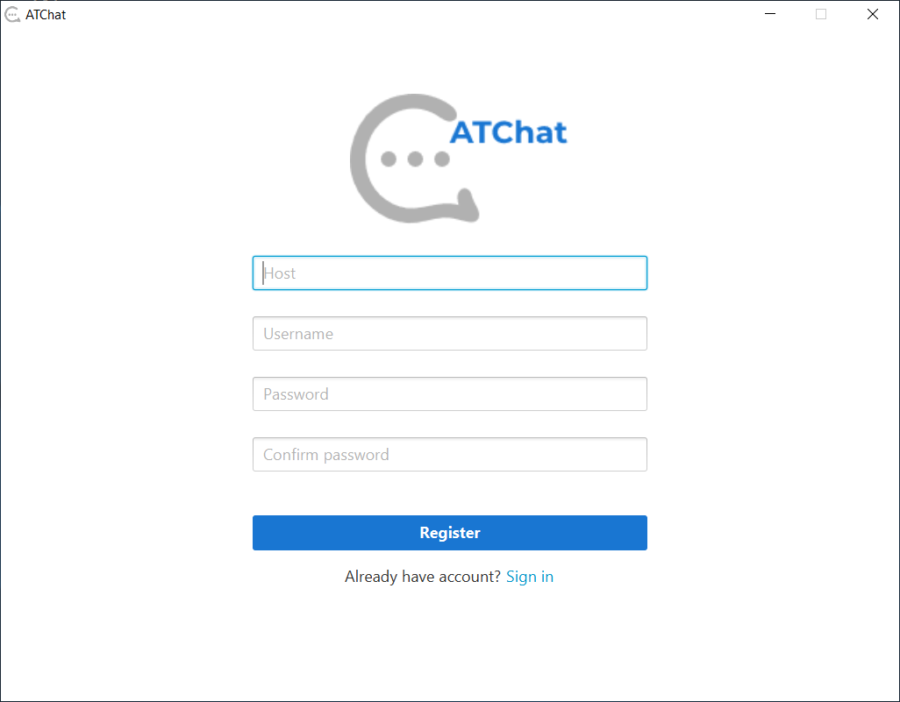

# ATChat
Simple chat application designed to communicate between users by sending text messages. Implemented using gRPC framework and JavaFx.

## Motivation
Project was created for practicing Java coding skills and getting to know the gRPC framework features.

## Overview
ATChat project consists of three modules:

**1. Common** - containing app's service definition protofile
* protofile specifies chat's models and methods for communication between client and server
* protocol buffer compiler (protoc) automatically generates data access classes in Java language out of above definition
* both client and server depends on this module

**2. Server** - containing server application, which handles network calls allowing clients to send messages and get active users
   
**3. Client** - containing simple JavaFx GUI application with three screens: 
* main chat screen which allows users to send and receive messages as well as see other active users in real time
* login - allows registered on selected server users to join chat
* register - allows to create account for selected chat server
* join as guest - allows to join chat as a guest
* loading placeholder


## Client app

| Main chat screen | Login screen |
| --- | --- |
|  |  |

| Register screen | Join as guest screen |
| --- | --- |
|  |  |

### Requirements
* Gradle 5.2.1
* JDK 8 with JavaFX
### Building and running
Client application is not distributed yet, in order to run project building from sources is necessary.
How to run:
1. Clone the project
2. Run
```
gradlew client:run
``` 

### Architecture
* EntryController, RegisterController, JoinAsGuestController and ChatboardController:
  - UI controllers, that extends BaseController class;
  - handle inputs provided by the user (like username, host address or message text) and pass them to the methods called on SceneCoordinator;
  - user can see new messages immediately and follow current users list thanks to observers held by ChatboardController, which, once notified, update UI with latest changes;
  - responsible for displaying error informations;
* SceneCoordinator:
  - coordinates switching between different scenes; 
  - holds an instance of ChatService that enables to send requests to the server using parameters provided by the user; 
  - uses Message- and UsersObservable instances, that notify UI observers about changes;
* ChatService - uses channel specified by server address and port number to create asynchronous stub that makes calls to the server;

## Server app
### Requirements
* Gradle 5.2.1
* JDK 8
### Install
[Server version 1.0](https://github.com/agata-tafelska/chat-grpc/releases/download/1.0-server/server-1.0-SNAPSHOT.zip) direkt download
### Building and running
In order to build and run the project from sources:
1. Clone the project
2. Run
```
gradlew server:run
``` 

### Architecture
* ServerApplication - main server class, that builds and starts server listening on port 9000;
* ChatStorage - interface for storing chat messages history; by default chat is saved in the file using FileChatStorage implementation; fallback is MemoryStorage;
* ChatServerService:
    - implements all service interface methods to let gRPC infrastructure decode incoming requests, execute these methods, and encode responses
    - holds map of users with their own users- and messages observers that enables to continuously update each user's chat state
    - adds user to the map once joined chat and remove from once logged out
    - additionally implements connection poller in order to update current user's list every 1 second to avoid showing on UI users who lost connection to the server

